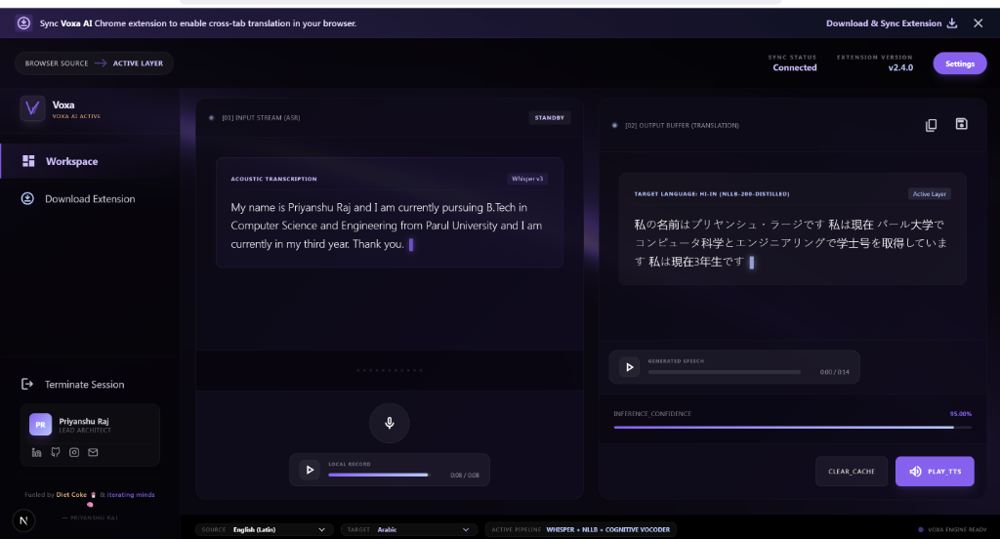

# 🌍 Voxa AI — Real-Time Multilingual Speech Translator

<p align="center">

Real-time AI-powered multilingual speech translation platform for meetings, lectures, interviews, webinars and browser audio.

Built using **FastAPI**, **Next.js**, **Chrome Extension**, **Whisper**, **NLLB-200**, **WebSockets**, and **Google Meet Tab Capture API**.

</p>

---

# Demo

## Dashboard


---

## Workspace



---

## Google Meet Translation


---

# What is Voxa?

Voxa AI is a browser-based real-time multilingual translation platform capable of translating live speech from:

- Google Meet
- Zoom (architecture ready)
- Microsoft Teams (architecture ready)
- Browser Audio
- Uploaded Audio
- Live Microphone

The platform captures browser audio, performs low-latency speech recognition using Whisper, translates into 200+ languages using Meta NLLB-200, restores punctuation, applies grammar correction, and streams translated subtitles back to both the dashboard and the meeting overlay in real time.

---

# Key Features

## AI Speech Recognition

- Whisper Large V3
- Streaming transcription
- Automatic language detection
- Low latency inference

---

## Translation Engine

- Meta NLLB-200
- 200+ supported languages
- Auto source language
- Manual source selection
- Manual target selection

---

## Smart Text Processing

- Grammar correction
- Punctuation restoration
- Sentence refinement
- Context-aware formatting

---

## Browser Extension

- Google Meet integration
- Floating subtitles
- Side Panel
- Browser Audio Capture
- Live waveform visualization

---

## Dashboard

- Real-time transcript viewer
- Translation viewer
- Confidence score
- Session controls
- Download Extension
- Extension Sync

---

# Architecture

```
                   User
                     │
                     ▼
              Next.js Dashboard
                     │
         REST API + WebSocket
                     │
                     ▼
            FastAPI Backend
                     │
      ┌──────────────┼──────────────┐
      │              │              │
 Whisper       Grammar Engine    NLLB-200
      │              │              │
      └──────────────┼──────────────┘
                     │
             Live Translation
                     │
     ┌───────────────┴────────────────┐
     │                                │
 Dashboard                    Chrome Extension
```

---

# Browser Extension Architecture

```
Google Meet

      │

meetDetector.js
      │
      ▼

background.js

      │

tabCapture API

      │

offscreen.js

      │

audioCapture.js

      │

PCM Audio

      │

WebSocket

      │

FastAPI Backend

      │

Whisper

      │

Grammar

      │

NLLB Translation

      │

WebSocket Response

      │

background.js

      │

───────────────┬────────────────

               │

floatingWidget.js

sidepanel.js
```

---

# Technology Stack

## Frontend

- Next.js
- React
- TypeScript
- TailwindCSS
- Framer Motion
- WebSocket Client

---

## Backend

- FastAPI
- Python
- WebSocket
- Uvicorn

---

## AI Models

- Whisper Large V3
- Meta NLLB-200 Distilled
- Grammar Correction
- DeepMultilingualPunctuation

---

## Browser APIs

- Chrome Extension Manifest V3
- Side Panel API
- Tab Capture API
- Offscreen Documents
- Runtime Messaging
- Storage API

---

# Complete Project Structure

```
MultiLingual Translator/

│

├── Frontend/
│   ├── Dashboard
│   ├── Workspace
│   ├── Download Extension
│   ├── Components
│   ├── Hooks
│   └── API Layer
│

├── Backend/
│   ├── API
│   ├── Services
│   ├── WebSocket
│   ├── Whisper
│   ├── Translation
│   ├── Grammar
│   └── Punctuation
│

├── Extension/
│   ├── background
│   ├── content
│   ├── offscreen
│   ├── popup
│   ├── sidepanel
│   ├── services
│   └── manifest.json
│

└── assets/
```

---

# Complete Translation Pipeline

```
Meeting Audio

↓

Chrome Tab Capture

↓

Offscreen Document

↓

Audio Processing

↓

PCM Conversion

↓

WebSocket

↓

FastAPI

↓

Whisper

↓

Detected Language

↓

Grammar

↓

Punctuation

↓

NLLB Translation

↓

JSON Response

↓

WebSocket

↓

Dashboard

↓

Floating Widget

↓

Side Panel
```

---

# AI Pipeline

```
Audio

↓

Voice Activity Detection

↓

Whisper

↓

Language Detection

↓

Grammar Correction

↓

Punctuation

↓

Sentence Refinement

↓

NLLB Translation

↓

Final Subtitle
```

---

# Latency Optimizations

✅ Streaming WebSockets

✅ PCM Audio Streaming

✅ Chunk-based Processing

✅ Browser-side Downsampling

✅ No Audio File Upload

✅ Incremental Translation

✅ Offscreen Processing

✅ Async FastAPI

---

# Browser Extension Flow

```
User joins Google Meet

↓

Meet Detector

↓

Background Worker

↓

Tab Capture

↓

Offscreen Document

↓

Audio Capture

↓

WebSocket

↓

Backend

↓

Translation

↓

Subtitle Rendering
```

---

# Deployment

Frontend

Vercel

Backend

Railway

Chrome Extension

Chrome Web Store

---

# Future Roadmap

- Voice Cloning
- AI Meeting Summary
- Speaker Diarization
- Live Captions Export
- Meeting Recording
- AI Notes
- AI Action Items
- Sentiment Analysis
- Zoom Integration
- Microsoft Teams Integration
- Safari Extension
- Firefox Extension

---

# Author

**Priyanshu Raj**

Computer Science Engineering

AI • Full Stack • Systems • Chrome Extensions

---

# License

MIT License
